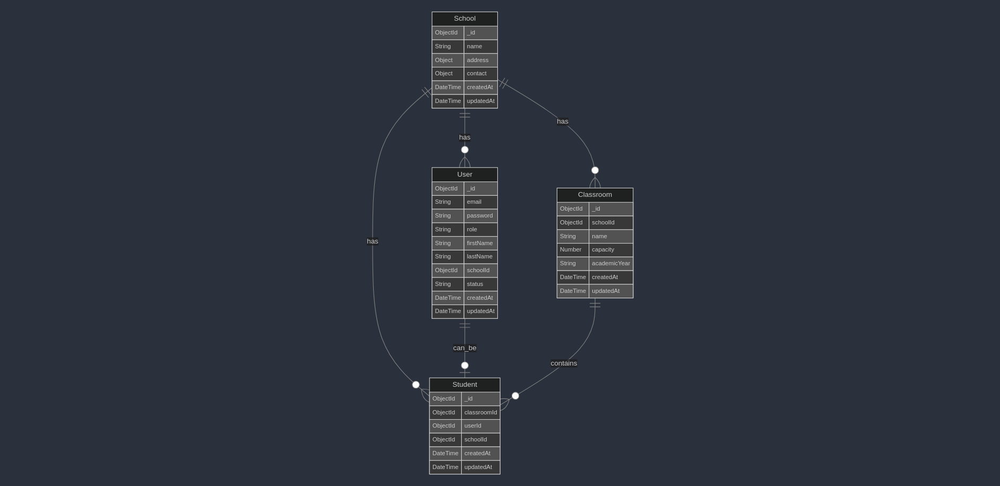

# School Management API  

This repository provides the School Management API, designed using the [Axion boilerplate](https://github.com/qantra-io/axion). The API facilitates managing Schools, Classrooms, and Students, with role-specific permissions for Superadmins, School Admins, and Students.  

---

## Key Features  

### **Entity Management**  

- **Schools**: Create, Read, Update, and Delete school records.  
- **Classrooms**: Manage classrooms linked to schools.  
- **Students**: Handle student information in classrooms.  

### **Role-Specific Permissions**  

- **Superadmins**: Full access to all data and user management.  
- **School Admins**: Limited to classrooms and students within their school.  
- **Students**: Restricted to viewing their school, classroom, and personal data.  

#### **Permissions Example**  

Permissions are assigned based on user roles, as shown below:  

```javascript  
const RESOURCES = {
 SCHOOL: 'school',
 CLASSROOM: 'classroom',
 STUDENT: 'student',
 USER: 'user'
};

const ACTIONS = {
 CREATE: 'create',
 READ: 'read',
 UPDATE: 'update',
 DELETE: 'delete',
 LIST: 'list',
 MANAGE: 'manage'
};

const ROLES = {
 SUPER_ADMIN: 'superAdmin',
 SCHOOL_ADMIN: 'schoolAdmin',
 STUDENT: 'student'
}

const ROLE_PERMISSIONS = {
 [ROLES.SUPER_ADMIN]: {
  [RESOURCES.SCHOOL]: [ACTIONS.CREATE, ACTIONS.READ, ACTIONS.UPDATE, ACTIONS.DELETE, ACTIONS.LIST, ACTIONS.MANAGE],
  [RESOURCES.USER]: [ACTIONS.CREATE, ACTIONS.READ, ACTIONS.UPDATE, ACTIONS.DELETE, ACTIONS.LIST, ACTIONS.MANAGE],
  [RESOURCES.CLASSROOM]: [ACTIONS.READ, ACTIONS.LIST],
  [RESOURCES.STUDENT]: [ACTIONS.READ, ACTIONS.LIST]
 },
 [ROLES.SCHOOL_ADMIN]: {
  [RESOURCES.SCHOOL]: [ACTIONS.READ],
  [RESOURCES.CLASSROOM]: [ACTIONS.CREATE, ACTIONS.READ, ACTIONS.UPDATE, ACTIONS.DELETE, ACTIONS.LIST, ACTIONS.MANAGE],
  [RESOURCES.STUDENT]: [ACTIONS.CREATE, ACTIONS.READ, ACTIONS.UPDATE, ACTIONS.DELETE, ACTIONS.LIST, ACTIONS.MANAGE],
 },
 [ROLES.STUDENT]: {
  [RESOURCES.SCHOOL]: [ACTIONS.READ],
  [RESOURCES.CLASSROOM]: [ACTIONS.READ],
  [RESOURCES.STUDENT]: [ACTIONS.READ, ACTIONS.UPDATE], // Can only read/update their own profile
 }
};

```  

### **Secure Authentication & Authorization**  

- **JWT-based authentication** ensures stateless security.  
- Fine-grained control over actions per role.  

---

## Deployment Details  

- **Live Server**: [Access the API](https://school-management-system-production-23a8.up.railway.app/)  
- **Postman Collection**: [Download Here](./school-management-system.postman_collection.json)  

---

## Running Locally

Here's the updated Markdown with the additional step for copying and updating the `.env` file:

1. **Clone the repository**:

   ```bash
   git clone https://github.com/ahmedheltaher/school-management-system
   ```

2. **Navigate to the project directory**:

   ```bash
   cd school-management-system
   ```

3. **Copy the `.env.example` file to `.env` and update the values as needed**:

   ```bash
   cp .env.example .env
   ```

   Open the `.env` file and update the values (e.g., database connection strings, secret keys) as required for your local setup.

4. **Install the dependencies**:

   ```bash
   npm install
   ```

5. **Start the services (MongoDB, Valley) using Docker Compose**:

   ```bash
   docker-compose up -d
   ```

6. **Run the development server**:

   ```bash
   npm run dev
   ```

---

## Additional Information  

- Test using the **Super Admin credentials**:  
  - **Username**: `admin@schools.com`  
  - **Password**: `password`  

---

## Database Schema


